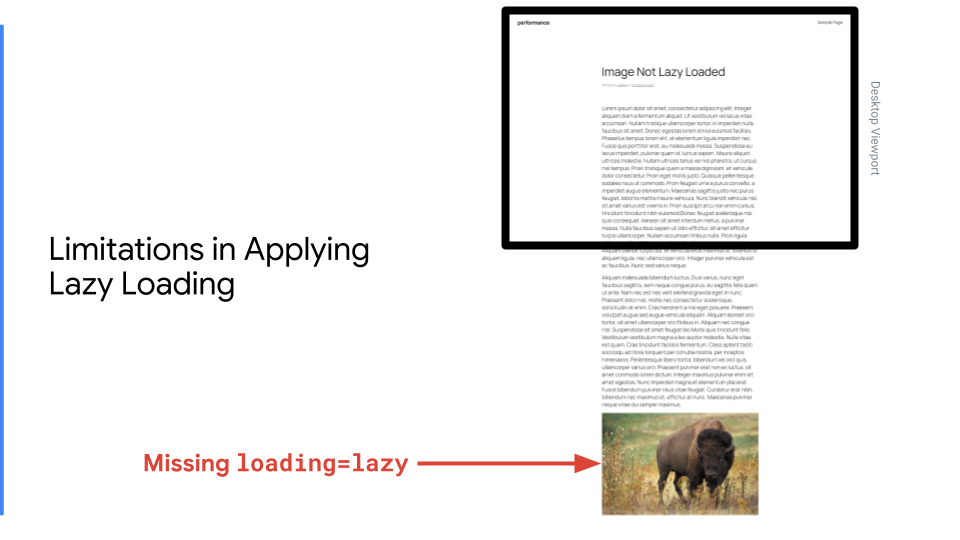
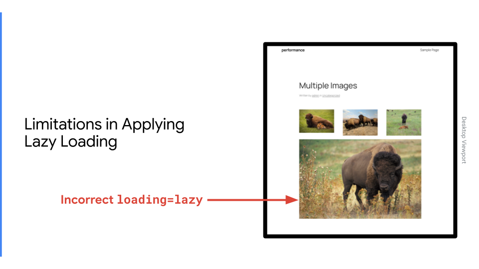
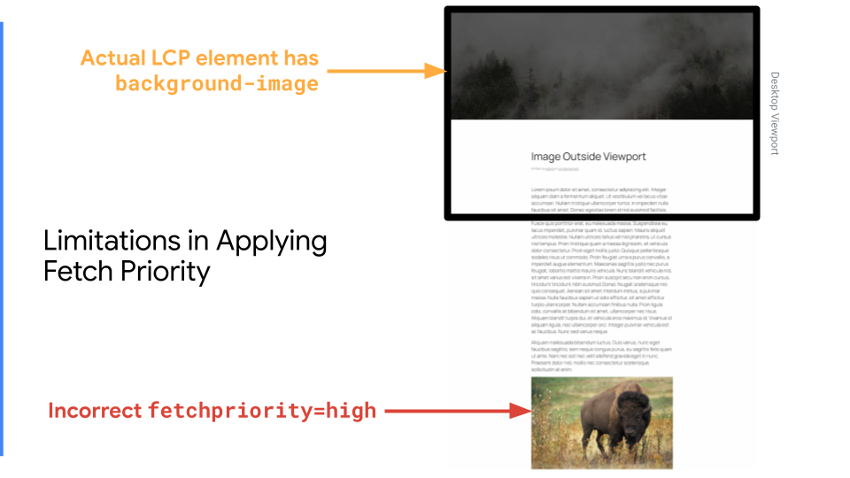
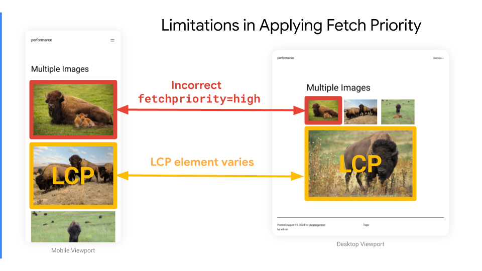
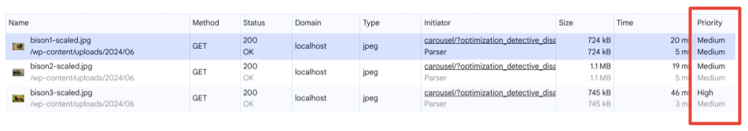
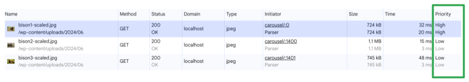
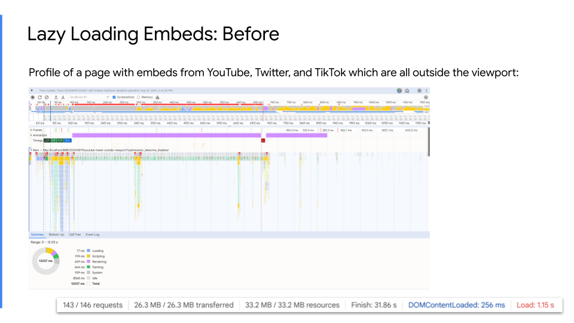
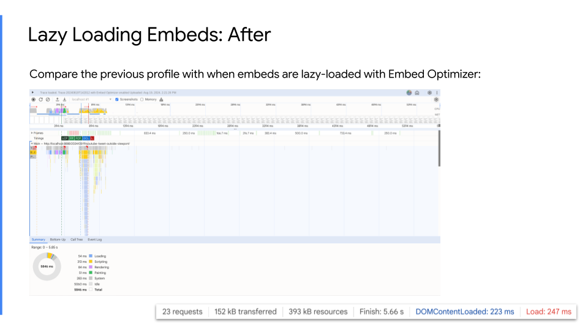
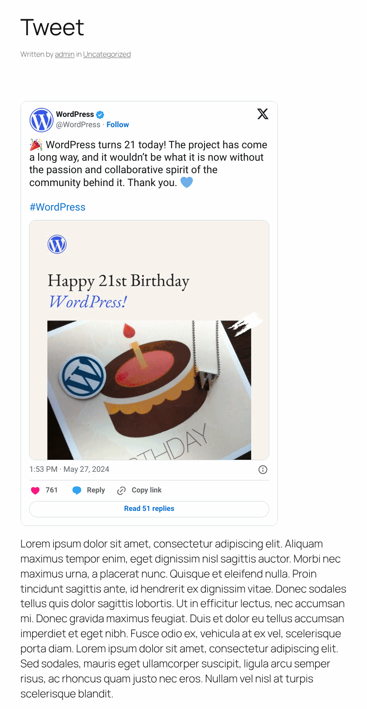

[Optimization Detective Documentation](./README.md):

# Optimization Detective Introduction

> [!NOTE]
> To see a table of contents for this document, select the outline button  in GitHub’s header above. This is a large document which will eventually be split up into smaller ones.

## Background

At WordCamp US 2022, [Felix Arntz](https://felix-arntz.me/) gave a talk called [Tackling performance in the WordPress ecosystem at scale](https://wordpress.tv/2022/12/18/tackling-performance-in-the-wordpress-ecosystem-at-scale/). In his talk, Felix talked about how WordPress endeavors to apply performance optimizations automatically. Since WordPress comprises such a large percentage of the web, any optimizations which can be done automatically will have big impacts on user experience across the web as a whole. Felix shared how WordPress uses smart defaults to improve performance for the majority of pages based on analyzing how they appear in HTTP Archive. However, we’re approaching a plateau in what can be done automatically based on limitations with the heuristics WordPress uses. Felix shares this [starting at 27:25](https://videopress.com/v/3o5DT6JX?at=1645) with a transcript edited here by Felix for clarity:

> One of the biggest challenges with these smart defaults today is that WordPress content is generated on the server-side in PHP. This means we have no idea on how that content is interpreted and loaded on the client-side. And we also don’t have any reliable information on certain aspects like the viewport size. So, that has also been a significant drawback in this lazy loading effort because…it’s about the viewport, which image should not be lazy loaded, but we could only use the server-side to make some “guess”, basically, about it. And that’s why we needed to do this whole analysis.
> 
> So let’s say, a WordPress user publishes a new page today and then several visitors visit this page. \[...\] WordPress simply serves the page from server side in its best capacity, but probably not fully optimized. Let’s dream here for a moment. Imagine we had a mechanism there, like some background script that ran in the frontend of the WordPress site to gather relevant client heuristics, and then this data could be sent to a new WordPress REST API endpoint where it would be processed and then stored in the WordPress database. Then for subsequent requests WordPress could use this information to serve the page content in an optimized way.
> 
> This may sound crazy, and of course there would be several complexities involved in this like around security, around storage, about the different viewports and responsiveness. But I also think what that would enable for WordPress and all sites out there would be massive. So many optimization techniques for performance require client awareness, like critical CSS, deferring JavaScript, resource prioritization in general, but also lazy loading images like I already said could be optimized even more with that, just to give you a few examples.
>
> I told you. I’m an optimist. But I truly believe we can achieve something like this. Not next month, and maybe not even next year, but I think we can work towards it from now on. Of course this requires a mindshift. We really need to try things. And we need to also be prepared for failures. We must avoid shutting down those types of ideas before they’re even attempted. I’d love for you to think about these ideas and paradigms further. Let’s start focusing more on ways that we can fix things in core out of the box without requiring every plugin and theme developer to use a certain API. What I really want to convey is APIs should still be part of the solution, but they should not be the full solution. Especially in regards to the last point, let’s brainstorm this further. I’d love to hear your ideas about that: of course, also, your concerns; we need that too. But let’s just not go into this like “Yeah, there’s no way we can get this into WordPress core.” We need to think big.

The Optimization Detective project is intended to be a realization of Felix’s dream. But before getting into the specifics of how Optimization Detective is implemented, let’s first look at some problematic areas where WordPress’s existing optimizations can fail to do the right thing.

## Limitations in Image Lazy Loading

In 2020, WordPress [added](https://make.wordpress.org/core/2020/01/29/lazy-loading-images-in-wordpress-core/) [image lazy loading](https://make.wordpress.org/core/2020/07/14/lazy-loading-images-in-5-5/) to reduce the amount of data being transferred over the network unnecessarily during page load. If an image is not displayed in the initial viewport for any device, why should the browser load the image and compete with resources that are in the critical rendering path for the initial viewport (i.e. content above the fold), including any `IMG` element which is the Largest Contentful Paint (LCP)? By lazy loading images which only appear outside the viewport, network contention is reduced so that the page can load faster. Nevertheless, it was later [discovered](https://make.wordpress.org/core/2021/07/15/refining-wordpress-cores-lazy-loading-implementation/) that adding `loading=lazy` to all images hurts LCP because a browser won’t start to download a lazy loaded image until it has laid out the page in order to determine whether the image is going to be shown. Only once the page layout has been computed will it start to download the image.

To help address this problem, WordPress doesn’t add `loading=lazy` to images in the header, and it is omitted from the [first three images](https://make.wordpress.org/core/2023/07/13/image-performance-enhancements-in-wordpress-6-3/) in the content (although initially it was just omitted from the [first content image](https://make.wordpress.org/core/2021/12/29/enhanced-lazy-loading-performance-in-5-9/)). Nevertheless, this default threshold (`wp_omit_loading_attr_threshold`) of three is just a smart default, and it is not based on which images are actually visible in the initial viewport. The server-side PHP heuristics have no idea how the page is actually laid out, so WordPress has to make educated guesses. These guesses can often be wrong. For example, consider a post which has a couple paragraphs of content followed by an Image block:



The `loading=lazy` attribute is omitted from this `IMG` tag because it is the first content image. However, this is wrong because the image is not visible in the initial viewport either on desktop or mobile devices. WordPress doesn’t know the height of these paragraph blocks, so it doesn’t know that the image is pushed outside the initial viewport. Nevertheless, this is not the worst for performance because it’s always better to err on the side of not lazy loading something because lazy loading an LCP image element is even [worse for performance](https://web.dev/articles/lcp-lazy-loading). But even lazy loading the LCP image element can still happen in WordPress.

Consider the case where you may have three images laid out horizontally in a Columns block, followed by a single Image block. In all there are four images, so WordPress omits `loading=lazy` from the first three but then adds it to the fourth:



It’s even worse in this specific scenario because the fourth image is the LCP element on desktop , and as mentioned above, lazy loading the LCP image element causes the browser to delay loading this most important resource.

## Limitations in Applying High Fetch Priority

As somewhat the inverse of lazy loading is the Fetch Priority API, namely adding `fetchpriority=high` to an `IMG`. This tells the browser it should prioritize loading the resource over other resources on the page. In 2023, enhancing LCP image performance with Fetch Priority was [proposed](https://make.wordpress.org/core/2023/05/02/proposal-for-enhancing-lcp-image-performance-with-fetchpriority/) for WordPress core, and later that year it [landed](https://make.wordpress.org/core/2023/07/13/image-performance-enhancements-in-wordpress-6-3/) and was [improved](https://make.wordpress.org/core/2023/10/18/image-loading-optimization-enhancements-in-6-4/). The performance enhancement added `fetchpriority=high` to the `IMG` which was determined to be the best candidate for being the LCP element. In many cases, the heuristics WordPress uses are correct, but unfortunately the problem remains that PHP on the server is unaware of how the page is actually laid out. It is easy to find scenarios where the LCP `IMG` element is not properly identified. For example, going back to the initial image lazy loading example:



Not only does WordPress incorrectly omit `loading=lazy` from this `IMG` tag which is outside the initial viewport for all devices, it *also* is adding `fetchpriority=high` to this tag. This is problematic because it increases network contention for other resources which are actually needed to render content above the fold. In this specific example, the header is the LCP element which has a CSS `background-image`, and WordPress cannot add `fetchpriority=high` to this. (Specifically, it is a Cover block with a fixed background.) So the image outside the viewport is prioritized by WordPress over loading the critical LCP image. This incorrect prioritization would also negatively impact other critical resources needed for the initial viewport, including stylesheets and fonts.

Another more fundamental problem with adding `fetchpriority=high` to an image is that often the LCP element on desktop will differ from the LCP element on mobile (and even differ from the LCP elements on tablet as well). Consider the previous example where there were four content images, three shown in columns and the fourth shown full size:



WordPress core adds `fetchpriority=high` to the first sufficiently-large image, which by default is 50,000 pixels (e.g. for a 200x250 image). In the example above, on desktop the image in the first column is only 136x91 because CSS is used to reduce its rendered size inside the column. So even though its dimensions in HTML indicate it is above the threshold, in how the page is actually rendered on desktop it should have been passed over. On mobile, however, the rendered size of the initial image is 300x200 so it is above the threshold and gets `fetchpriority=high`. Nevertheless, the second image on mobile is actually a little bit taller at 300x225, so on a mobile viewport the *second* image is actually the LCP element. And on desktop, as mentioned above, it’s the fourth image not inside the Columns block which is actually the LCP element. So in adding `fetchpriority=high` to an `IMG` tag, not only can WordPress’s existing heuristics do so for the wrong image on both desktop and mobile, but even if it does so correctly for either mobile or desktop, this can result in being incorrect for the other device form factor since LCP elements vary by viewport size. Adding `fetchpriority=high` to an `IMG` is only correct when it is the LCP element for all device form factors, e.g. mobile, tablet, and desktop. On the server-side in WordPress, you cannot reliably provide different HTML attributes for different viewports, so that makes it impossible to apply `fetchpriority=high` with 100% accuracy—even if WordPress Core's server-side guesstimate was perfect.

# The Solution

In his talk, Felix envisioned a future solution of a way to automatically apply optimizations which were not limited by WordPress’s server-side unawareness of how the page is laid out. He outlined a possible implementation which would apply optimizations based on how a user experiences a page:

![Slide from Felix's talk where he describes his dream of how core can fix performance issues automatically by implementing them based on usage: (1) Develop routines that inspect frontend behavior. (2) "Learn" the best behavior from user interaction. (3) Use server-side content filters (particularly with Full Site Editing) and client-side logic to get results as accurate as possible. A diagram also shows a cycle where a user agent sends viewport related data to the REST API which then processes and stores this data in the database, and then WordPress optimizes the response based on this data.](images/felix-dream.png)

This is very close to what was implemented by the Core Performance Team in Optimization Detective, a framework for leveraging real user metrics to detect optimizations for improving page performance. It solves the problem of WordPress not being able to apply optimization accurately due to not knowing how the page is laid out, and this is solved by adding frontend measurement.

The approach is heavily inspired by Philip Walton’s [Dynamic LCP Priority: Learning from Past Visits](https://philipwalton.com/articles/dynamic-lcp-priority/). See also the initial exploration document that laid out this project: [Image Loading Optimization via Client-side Detection](https://docs.google.com/document/u/1/d/16qAJ7I_ljhEdx2Cn2VlK7IkiixobY9zNn8FXxN9T9Ls/view).

At a high level, the way it works is as follows:

1. A visitor comes to the page using their mobile device.
2. Each image on the page is measured for whether it is in the viewport, whether it is the LCP element, and what its dimensions are.
3. The measurements are sent to the REST API and stored.
4. For subsequent visitors on mobile, these measurements are used to optimize the response (e.g. adding `fetchpriority=high` to the LCP image, omitting `loading=lazy` from images in the first viewport).
5. For visitors on other device form factors (e.g. tablet, desktop), the same process happens for them respectively.

The implementation involves two phases: detection and optimization. Both of these phases can happen concurrently. If detection has not run yet, then optimization cannot occur until detection has captured the necessary measurements. Conversely, if new measurements are not needed, then the optimization phase happens without any concurrent detection phase.

## Detection Phase

The detection phase involves collecting metrics about the viewport and the elements on the page and then submitting this data to the site’s REST API:

1. Extensions register tag visitors which opt in to measurement for the elements they target for optimization. (As elaborated in a section below, tag visitors are simply callbacks which are invoked for every open tag.)
2. The rendered page is captured in an output buffer (which starts at the `template_include` filter with the highest priority). Output buffering ensures that optimizations can be applied to classic themes, block themes, or even completely custom templating systems (e.g. Timber).
3. The rendered page is loaded into an HTML Tag processor instance ([introduced](https://make.wordpress.org/core/2023/03/07/introducing-the-html-api-in-wordpress-6-2/) in WP 6.2).
4. The open tags are iterated over, and all registered tag visitors are invoked for each open tag, giving them the opportunity to opt in the tag for measurement via the `track_tag()` method on the tag visitor context object. A tag which is opted in for measurement will get a `data-od-xpath` attribute added to it.
5. The detection script module is added to the frontend (`detect.js`).
6. Once the page has loaded, the detection script collects data about the page to compose a “URL Metric” object (described below). This involves the use of [web-vitals.js](https://github.com/GoogleChrome/web-vitals) to detect the LCP element and the [Intersection Observer API](https://developer.mozilla.org/en-US/docs/Web/API/Intersection_Observer_API) to detect the visibility of elements in the viewport. The elements which have the `data-od-xpath` attribute are measured.
7. When the visitor leaves the page, the collected URL Metric data is sent to a REST API endpoint on the site (`optimization-detective/v1/url-metrics:store`).
8. The submitted data is then validated and stored in an `od_url_metrics` custom post type (described below) along with other collected URL Metrics for that URL.

## Optimization Phase

The optimization phase involves applying performance fixes to the page based on the collected data during detection:

1. Extensions register tag visitors which apply optimizations to the tags which were opted-in for measurement during detection. (In practice, this same tag visitor is used for both detection and optimization.)
2. The previously collected URL Metrics for the current request are loaded from the associated `od_url_metrics` post.
3. The rendered page is captured in the same output buffer as during the detection phase.
4. The rendered page is loaded into an HTML Tag Processor instance, again the same as during the detection phase.
5. Also as in the detection phase, all open tags are iterated over and all registered tag visitors are invoked for each.
6. When a tag visitor is invoked on a relevant tag, it applies optimizations to the tag based on the measurements stored in URL Metrics (during detection).

# Collecting URL Metrics

WordPress is not designed to do something like collect URL Metrics from every page visit. Therefore, only a sampling of visits have URL Metrics collected. First of all, the responsive breakpoints 480px, 600px, and 782px are used to group URL Metrics by viewport width into the following buckets: 

| Name    | Media Query          |
|:--------|:---------------------|
| Mobile  | `0 < width <= 480`   |
| Phablet | `480 < width <= 600` |
| Tablet  | `600 < width <= 782` |
| Desktop | `width < 782`        |

These specific breakpoints were chosen based on media query usage in core block styles. They can be customized via the `od_breakpoint_max_widths` filter. Then for each viewport group, a sample of three (3) URL Metrics are collected. This can be customized with the `od_url_metrics_breakpoint_sample_size` filter. This means that for each URL, a maximum of twelve URL Metrics are collected (3 x 4).

Once the full sample has been collected for a viewport group, the detection logic (`detect.js`) no longer runs for page loads with a related viewport width. The detection logic will run again when either of the following conditions occur:

1. Detection is needed when a collected URL Metric for the current viewport group has become stale. By default, a URL Metric is considered fresh for one week. This can be customized with the `od_url_metric_freshness_ttl` filter.
2. Detection is also initiated when the page state has changed since the point at which a URL Metric was collected. The page state is captured in a URL Metric's “ETag”, which is a hash computed from an array including the last modified times of the posts in the loop, the active theme, and the active plugins. The data that goes into computing such an ETag can be customized with the `od_current_url_metrics_etag_data` filter.

When either of these conditions are true, the detection logic will attempt to collect URL Metrics for visitors with the needed viewport dimensions. Note that the REST API endpoint for submitting URL Metrics (`optimization-detective/v1/url-metrics:store`) does not require authentication since in order to optimize a page effectively for real visitors it is important to collect measurements from real user visits. In order to guard against abuse, unauthenticated URL Metric storage requests are restricted to being made once per minute. This is called the “storage lock” and the duration can be customized via the `od_url_metric_storage_lock_ttl` filter. The storage lock time is stored in a transient keyed by a hash of the user’s IP address to protect privacy. An attempted REST API request to store a URL Metric while there is an active storage lock will result in a `423 Locked` error response from the REST API endpoint. Not only this but there is also a client-side storage lock in `sessionStorage` which prevents a user from attempting to submit a URL Metric when the server would reject the request due to there being a storage lock in place. This client-side storage lock also prevents the same client from submitting a second URL Metric from the same viewport group for the same URL after the lock has transpired. This is done to increase the diversity of the clients submitting URL Metrics.

While unauthenticated users are restricted to submitting URL Metrics once a minute by default, this restriction is lifted for users who are logged-in as administrators. This allows an administrator to quickly populate initial URL Metrics by browsing a site. The ability to bypass the storage lock TTL is granted by the `od_store_url_metric_now` user capability, which by default maps to whether the user can `manage_options`.

The URL Metric is submitted when the user leaves the page. The `navigator.sendBeacon()` API is used to submit the URL Metric so it can be sent even after the page has gone away.

# The URL Metric Schema

The client-side detection logic constructs a URL Metric object with the measurements which are needed in order to effectively optimize a page. The URL Metric object is precisely defined by JSON Schema, and it contains the following root properties:

| Property    | Description                                                                                                                                                                                                                                                                                                     |
|:------------|:----------------------------------------------------------------------------------------------------------------------------------------------------------------------------------------------------------------------------------------------------------------------------------------------------------------|
| `uuid`      | Unique identifier for the URL Metric, provided by the REST API endpoint at submission. This is primarily used for debugging during development.                                                                                                                                                                 |
| `url`       | The exact URL as it appeared for the request, including any GET params which aren’t recognized as WP query vars. This is useful for debugging. See description of `od_url_metrics` post type below which explains how a hash of the WP query vars is used to locate the URL Metrics related to a given request. |
| `timestamp` | The Unix timestamp in microseconds provided by the REST API endpoint when submitted.                                                                                                                                                                                                                            |
| `etag`      | A hash of various aspects of page state, including last modified times and the active theme and plugins.                                                                                                                                                                                                        |
| `viewport`  | The `width` and `height` of the client browser window.                                                                                                                                                                                                                                                          |
| `elements`  | An array of element objects for the tags which had been opted-in to measurement.	See properties below.                                                                                                                                                                                                          |

Each element has the following properties:

| Property             | Description                                                             |
|:---------------------|:------------------------------------------------------------------------|
| `xpath`              | An XPath expression to uniquely identify the element.                   |
| `isLCP`              | Whether the element was the LCP element as determined by web-vitals.js. |
| `isLCPCandidate`     | Whether the element was an LCP candidate.                               |
| `intersectionRatio`  | How visible the element was in the viewport.                            |
| `intersectionRect`   | The dimensions for the element’s visibility in the viewport.            |
| `boundingClientRect` | The dimensions of the element.                                          |

These are all the core properties required by the URL Metric schema. However, extensions can register additional properties at either the URL Metric root (via the `od_url_metric_schema_root_additional_properties` filter) or at the element (via the `od_url_metric_schema_element_item_additional_properties` filter).

The format of the XPath expression warrants further discussion. A typical XPath for an element in a URL Metric looks like the following, here for an `IMG` inside of a Cover block in the header of a block theme:

```xpath
/HTML/BODY/DIV[@class='wp-site-blocks']/*[1][self::HEADER]/*[1][self::DIV]/*[2][self::IMG]
```

The `HTML` and `BODY` tags lack any XPath predicates because there is no possible ambiguity. Children of the `BODY` include a predicate which references the `id`, `role`, or `class` attribute to disambiguate it from other siblings (e.g. those rendered at `wp_body_open`). Below this level, all elements are referenced like `*[1][self::IMG]` in order to avoid ambiguity between siblings. For example, if an `IMG` is the first child node then it has the aforementioned XPath, but if a paragraph were added before it then it would become `*[2][self::IMG]`. This is in contrast with `IMG[1]` which would continue to match the first `IMG` whether it was the first child or not. The predicates were chosen to ensure that the XPath continues to reference elements in the same page structure as when the detection logic obtained its measurements and constructed the URL Metric.

Note that the XPath is not actually used for querying the DOM. It is just used as a stable string to uniquely identify the same element across the captured URL Metrics, for example to determine whether it is the LCP element for all viewport groups (mobile through desktop).

The maximum size a URL Metric is permitted to be is 64 kibibyte (65,536 bytes) which is the maximum size allowed when sending data via `navigator.sendBeacon()`. 

# The `od_url_metrics` Post Type

After a URL Metric has been submitted to the REST API storage endpoint and is validated, it is stored in a post of the `od_url_metrics` post type. This custom post type is not exposed anywhere and is only used internally by Optimization Detective (although extensions can create user interfaces to view URL Metrics, like the prototype [Admin UI](https://github.com/westonruter/od-admin-ui) plugin). The post fields used by Optimization Detective are as follows:

| Field          | Description                                                                                                               |
|:---------------|:--------------------------------------------------------------------------------------------------------------------------|
| `post_name`    | A MD5 hash of WP query vars.                                                                                              |
| `post_content` | A JSON array of all the URL Metric objects.                                                                               |
| `post_title`   | The `url` property of the most recent URL Metric stored in the post. (This is useful when listing out posts with WP-CLI.) |

The slug (`post_name`) of the post is derived from the public WP query vars (`$wp->query_vars`) since site traffic may often request URLs that contain arbitrary query parameters that have no impact on the rendered page (e.g. UTM parameters). So using these WP query vars ensures that such insignificant URL variations are normalized. If there are URL Metrics for separate distinct URLs being stored in the same `od_url_metrics` post unexpectedly, it may be due to a significant GET query parameter not being registered among the public query vars via the `query_vars` filter. For example, if you have a contact form which redirects back to itself with a `?thank_you=1` in the URL to show a "thank you" message instead of the submission form, and this template contains the following:

```php
if ( isset( $_GET['thank_you'] ) ) {
	my_theme_print_thank_you_message();
} else {
	my_theme_print_contact_form();
}
```

Then URL Metrics for both `/contact-form/` and `/contact-form/?thank_you=1` will be (incorrectly) stored in the same `od_url_metrics` post. To account for this, you should be sure to register any public query vars that impact the rendering of the template via the `query_vars` filter, for example:

```php
add_filter( 'query_vars', function ( $query_vars ) {
	$query_vars[] = 'thank_you';
	return $query_vars;
} );
```

Then in your template code you may continue to use `isset( $_GET['thank_you'] )` but you might as well use `get_query_var( 'thank_you' )` instead.

When an `od_url_metrics` post has not been updated in a month then it is garbage-collected, since it is likely the original URL has gone away.

Extensions to Optimization Detective rarely need to directly interface with the custom post type, so far. See the experimental [Optimization Detective Content Visibility](https://github.com/westonruter/od-content-visibility/) plugin which interfaces with the `od_url_metrics` post at submission time to add post meta via the `od_url_metric_stored` action, and then retrieves post meta in the tag visitor via the context object’s `url_metrics_id` property.

# Conditional Optimization

Not every request to a site is eligible for optimization. This is particularly the case when it is unlikely that a given request will result in a URL Metric during detection which will ever be successfully used in optimization. Detection and optimization will not occur by default in any of the following conditions:

| Condition          | Template Conditional     | Rationale                                                                                                                                                                                                     |
|:-------------------|:-------------------------|:--------------------------------------------------------------------------------------------------------------------------------------------------------------------------------------------------------------|
| Searches           | `is_search()`            | Since the URL space for searches is infinite, it is unlikely for there to be a significant number of repeat queries.                                                                                          |
| Post embeds        | `is_embed()`             | There isn’t much to optimize in a post preview, and IFRAME sandbox restrictions can prevent the detection logic from working anyway.                                                                          |
| Post previews      | `is_preview()`           | A post that isn’t published yet is likely to be undergoing additional changes. Detection should only occur when the content has stabilized.                                                                   |
| Customizer preview | `is_customize_preview()` | Injection of inline editing controls can cause XPath variations. In any case, no need to optimize in this context.                                                                                            |
| Non-`GET` requests | --                       | The responses to `POST` requests often will reflect back the submitted content which won’t occur again (e.g. a form submission).                                                                              |
| Empty post loops   | --                       | Optimization Detective triggers post edit actions as a signal for full page caching layers to invalidate their caches. If there are no posts in the loop, then there is nothing available for this signaling. |

These conditions can all be overridden with the `od_can_optimize_response` filter.

# Tag Visitors

As mentioned above, the detection phase and the optimization phase both depend on extensions registering tag visitors. These tag visitors opt in specific tags for measurement, and then they also apply optimizations based on the measurements stored in URL Metrics. The primary responsibility for an extension of the Optimization Detective framework is to register a tag visitor.

A tag visitor is simply a callback which is invoked for every open tag on the document. (That is, every tag except for those in the Admin Bar and `NOSCRIPT` elements.) The callback may be a regular PHP function, a class method, a closure, or even a class with an `__invoke()` method defined. Tag visitors are passed a context object (`OD_Tag_Visitor_Context`) which includes the following properties:

1. `processor` (`OD_HTML_Tag_Visitor`): The HTML Tag Processor instance with the cursor at the current open tag.
2. `url_metric_group_collection` (`OD_URL_Metric_Group_Collection`): The collection of URL Metrics collated into their viewport groups. This object includes helper methods for querying URL Metrics for data needed to perform optimizations.
3. `link_collection` (`OD_Link_Collection`): An interface for adding preload/preconnect/etc links to the response (both as `LINK` tags and `Link` HTTP headers).

The context object also exposes a `track_tag()` method which is used by the tag visitor to opt in the tag for measurement and storage among the submitted URL Metric’s `elements`. This is called only after inspecting the `$processor` for whether the cursor is currently at a relevant tag, such as by looking at `$processor->get_tag()` or `$processor->has_class()`. Note that you are free to call `$processor->next_tag()` in the callback (such as to walk over any child tags) since the tag processor's cursor will be reset to the current open tag after each tag visitor callback completes. This is used in extensions, for example, to optimize `PICTURE` tags (in [Image Prioritizer](https://wordpress.org/plugins/image-prioritizer/)) and Embed blocks (in [Embed Optimizer](https://wordpress.org/plugins/embed-optimizer/)).

As noted above, the HTML Tag Processor is instantiated after the output buffering of the rendered page has been completed. Just before shutdown, the “optimization loop” iterates over every open tag and passes the context to all registered tag visitors. Therefore, all optimizations must be performed from within the tag visitor callback. The core mutations currently supported are those which are implemented in [`WP_HTML_Tag_Processor`](https://developer.wordpress.org/reference/classes/wp_html_tag_processor/), including:

* Manipulating tag attributes via `set_attribute()` and `remove_attribute()`
* Manipulating classes via `add_class()` and `remove_class()`
* Setting the text content of an element (e.g. a `STYLE` tag) via `set_modifiable_text()`

In the future, it is intended for Optimization Detective to replace the use of `WP_HTML_Tag_Processor` with `WP_HTML_Processor` which will allow for additional mutation possibilities. In the meantime, the Optimization Detective subclass does provide two additional methods for injecting arbitrary HTML at the end of the `HEAD` and `BODY`: `$processor->append_head_html()` and `$processor->append_body_html()`. These are useful, for example, to inject additional styles and scripts into the page. The Optimization Detective subclass does implement some methods which are otherwise only available on `WP_HTML_Processor`:

* `expects_closer()`: Whether the tag expects a closing tag.
* `get_breadcrumbs()`: Computes the HTML breadcrumbs for the currently-matched node.
* `get_current_depth()`: Returns the nesting depth of the current location in the document.

In addition to these, the following methods are also implemented which are useful for tag visitors:

* `get_xpath()`: This all-important method computes the XPath expression for the current open tag. This is used extensively in tag visitors to locate the current element in the URL Metrics.
* `set_meta_attribute()`: Sets an attribute with a name prefixed by “`data-od-`”. This is used to add the `data-od-xpath` attribute to tags needing to be measured during detection. It is also used to annotate the attribute changes that tag visitors have performed (for debugging). Extensions can also use this attribute to add their own meta attributes for debugging purposes or for the needs of their own client-side extensions (see below).

Here is an annotated example of a tag visitor which adds `fetchpriority=high` to the `IMG` which is the common LCP element across all viewport groups:

```php
add_action( 'od_register_tag_visitors', function ( OD_Tag_Visitor_Registry $registry ) {

	// Register a tag visitor callback with an arbitrary ID.
	$registry->register( 'lcp-img-fetchpriority-high', function ( OD_Tag_Visitor_Context $context ) {
		if ( $context->processor->get_tag() !== 'IMG' ) {
			return; // Tag is not relevant for this tag visitor.
		}

		// Mark the tag for measurement during detection so that it is included among the elements stored in URL Metrics.
		$context->track_tag();

		// Get the common LCP element across all breakpoints as captured in the URL Metrics.
		$common_lcp_element = $context->url_metric_group_collection->get_common_lcp_element();

		// Make sure fetchpriority=high is added to LCP IMG elements based on the captured URL Metrics.
		if ( isset( $common_lcp_element ) && $common_lcp_element->get_xpath() === $context->processor->get_xpath() ) {
			$context->processor->set_attribute( 'fetchpriority', 'high' );
		}
	} );
} );
```

Please note this implementation of setting `fetchpriority=high` on the LCP `IMG` element is simplified. Refer to the [Image Prioritizer](https://wordpress.org/plugins/image-prioritizer/) extension for a more robust implementation.

If a tag visitor does not rely on URL Metrics to perform an optimization, then there is no need to call the `track_tag()` method to opt in the tag for measurement during detection. For example, the following tag visitor adds `decoding=async` to every `IMG` tag independent of any URL Metric data:

```php
$tag_visitor_registry->register(
	'img-decoding-async',
	static function ( OD_Tag_Visitor_Context $context ): bool {
		if ( $context->processor->get_tag() !== 'IMG' ) {
			return; // Tag is not relevant for this tag visitor.
		}

		// Set the decoding attribute if it is absent.
		if ( null === $context->processor->get_attribute( 'decoding' ) ) {
			$context->processor->set_attribute( 'decoding', 'async' );
		}
	}
);
```

Most of the time, however, tag visitors will depend on URL Metrics to apply optimizations since otherwise WordPress can simply apply the optimization during template rendering, as it already does with adding `decoding=async` to every `IMG` tag.

# Working with URL Metrics

As noted and shown above, tag visitors apply optimizations based on the captured URL Metrics, and these are exposed to a tag visitor via the `$context->url_metric_group_collection`. This is an instance of the `OD_URL_Metric_Group_Collection` which is itself an iterable of `OD_URL_Metric_Group` instances, one for each viewport group. Each `OD_URL_Metric_Group` instance is then an iterable of the underlying `OD_URL_Metric` instances. Each of these classes—`OD_URL_Metric_Group_Collection`, `OD_URL_Metric_Group`, and `OD_URL_Metric`—exposes methods which facilitate applying optimizations in tag visitors. For how these methods are used in practice, refer to the [Use Case and Examples](https://github.com/WordPress/performance/blob/trunk/plugins/optimization-detective/docs/extensions.md). The relevant methods for tag visitors exposed on each are as follows:

## [`OD_URL_Metric_Group_Collection`](https://github.com/WordPress/performance/blob/trunk/plugins/optimization-detective/class-od-url-metric-group-collection.php) (implements `Countable`, `IteratorAggregate`, `JsonSerializable`)

| Method                                                                     | Description                                                                                                                                                     |
|:---------------------------------------------------------------------------|:----------------------------------------------------------------------------------------------------------------------------------------------------------------|
| `getIterator(): ArrayIterator`                                             | Returns an iterator for the groups of URL Metrics.                                                                                                              |
| `count(): int`                                                             | Counts the URL Metric groups in the collection.                                                                                                                 |
| `get_first_group(): OD_URL_Metric_Group`                                   | Gets the first URL Metric group (with the lowest minimum viewport width, e.g. for mobile).                                                                      |
| `get_last_group(): OD_URL_Metric_Group`                                    | Gets the last URL Metric group (with the highest minimum viewport width, e.g. for desktop).                                                                     |
| `get_group_for_viewport_width( int $viewport_width ): OD_URL_Metric_Group` | Gets the group for the provided viewport width.                                                                                                                 |
| `is_any_group_populated(): bool`                                           | Checks whether any group is populated with at least one URL Metric.                                                                                             |
| `is_every_group_populated(): bool`                                         | Checks whether every group is populated with at least one URL Metric each.                                                                                      |
| `is_every_group_complete(): bool`                                          | Checks whether every group is complete (full sample of non-stale URL Metrics).                                                                                  |
| `get_groups_by_lcp_element( string $xpath ): OD_URL_Metric_Group[]`        | Gets the groups which have an LCP element with the provided XPath.                                                                                              |
| `get_common_lcp_element(): ?OD_Element`                                    | Gets the LCP element which is shared by all groups, or at least the first group (mobile) and last group (desktop) if the intermediary groups are not populated. |
| `get_xpath_elements_map(): array`                                          | Gets all elements from all URL Metrics from all groups keyed by the elements' XPaths.                                                                           |
| `get_all_element_max_intersection_ratios(): array`                         | Gets the max intersection ratios of all elements across all groups and their captured URL Metrics.                                                              |
| `get_all_elements_positioned_in_any_initial_viewport(): array`             | Gets the status for whether each element is positioned in any initial viewport.                                                                                 |
| `get_element_max_intersection_ratio( string $xpath ): ?float`              | Gets the max intersection ratio of an element across all groups and their captured URL Metrics.                                                                 |
| `is_element_positioned_in_any_initial_viewport( string $xpath ): ?bool`    | Determines whether an element is positioned in any initial viewport.                                                                                            |
| `get_flattened_url_metrics(): OD_URL_Metric[]`                             | Gets URL Metrics from all groups flattened into one list.                                                                                                       |
| `jsonSerialize(): array`                                                   | Specifies data which should be serialized to JSON.                                                                                                              |

## [`OD_URL_Metric_Group`](https://github.com/WordPress/performance/blob/trunk/plugins/optimization-detective/class-od-url-metric-group.php) (implements `IteratorAggregate`, `Countable`, `JsonSerializable`)

| Method                                                        | Description                                                                                            |
|:--------------------------------------------------------------|:-------------------------------------------------------------------------------------------------------|
| `getIterator(): ArrayIterator`                                | Returns an iterator for the groups of URL Metrics.                                                     |
| `count(): int`                                                | Counts the URL Metrics in the group.                                                                   |
| `get_minimum_viewport_width(): int`                           | Gets the minimum possible viewport width (exclusive).                                                  |
| `get_maximum_viewport_width(): ?int`                          | Gets the maximum possible viewport width (inclusive).                                                  |
| `get_collection(): OD_URL_Metric_Group_Collection`            | Gets the collection that this group is a part of.                                                      |
| `is_viewport_width_in_range( int $viewport_width ): bool`     | Checks whether the provided viewport width is between the minimum (exclusive) and maximum (inclusive). |
| `is_complete(): bool`                                         | Determines whether the URL Metric group is complete.                                                   |
| `get_lcp_element(): ?OD_Element`                              | Gets the LCP element in the viewport group.                                                            |
| `get_xpath_elements_map(): array`                             | Gets all elements from all URL Metrics in the viewport group keyed by the elements' XPaths.            |
| `get_all_element_max_intersection_ratios(): array`            | Gets the max intersection ratios of all elements in the viewport group and its captured URL Metrics.   |
| `get_element_max_intersection_ratio( string $xpath ): ?float` | Gets the max intersection ratio of an element in the viewport group and its captured URL Metrics.      |
| `jsonSerialize(): array`                                      | Specifies data which should be serialized to JSON.                                                     |

## [`OD_URL_Metric`](https://github.com/WordPress/performance/blob/trunk/plugins/optimization-detective/class-od-url-metric.php) (implements `JsonSerializable`)

| Method                              | Description                                        |
|:------------------------------------|:---------------------------------------------------|
| `get_group(): ?OD_URL_Metric_Group` | Gets the group that this URL Metric is a part of.  |
| `get( string $key ): mixed`         | Gets property value for an arbitrary key.          |
| `get_uuid(): string`                | Gets UUID.                                         |
| `get_etag(): string`                | Gets ETag.                                         |
| `get_url(): string`                 | Gets URL.                                          |
| `get_viewport(): array`             | Gets viewport data.                                |
| `get_viewport_width(): int`         | Gets viewport width.                               |
| `get_timestamp(): float`            | Gets timestamp.                                    |
| `get_elements(): OD_Element[]`      | Gets elements.                                     |
| `jsonSerialize(): array`            | Specifies data which should be serialized to JSON. |

# Client-side Extensions

Sometimes the core measurements collected in a URL Metric are not sufficient to perform the desired optimization. Consider optimizing an Embed block to reserve space so that it does not cause a layout shift once it loads, thus optimizing the Cumulative Layout Shift (CLS) score. To achieve this, an extension needs to do two things in addition to registering the tag visitor:

1. Extend the element schema with a new property that stores the resized element’s dimensions.
2. Add a frontend script which uses a Resize Observer to capture this resize data and then amends the element in the URL Metric accordingly.

Here is an example for extending the JSON Schema for an element:

```php
add_filter( 
	'od_url_metric_schema_element_item_additional_properties', 
	function ( array $additional_properties ) {
		$additional_properties['resizedBoundingClientRect'] = array(
			'type'       => 'object',
			'properties' => array_fill_keys(
				array( 'width', 'height', 'x', 'y', 'top', 'right', 'bottom', 'left' ),
				array(
					'type'     => 'number',
					'required' => true,
				)
			),
		);
		return $additional_properties;
	} 
);
```

Then the `od_extension_module_urls` filter is used to add the URL to a script module to a list of other such script module URLs that should be loaded during detection:

```php
add_filter(
	'od_extension_module_urls',
	function ( array $extension_module_urls ) {
		$extension_module_urls[] = plugins_url( 
			add_query_arg( 'ver', '1.0', 'detect.js' ), 
			__FILE__ 
		);
		return $extension_module_urls;
	}
);
```

The `detect.js` file is a script module which exports two async functions: `initialize` and `finalize`. The `initialize` function is invoked by Optimization Detective when detection starts, and `finalize` naturally is invoked when the page is left and the URL Metric is being constructed for submission. The full typing for what an extension looks like is defined via TypeScript in [`types.ts`](https://github.com/WordPress/performance/blob/42bd7a88da1df3195f9f076331d9dd157e3b2a86/plugins/optimization-detective/types.ts#L52-L79). Here is an example `detect.js` module script which amends the URL Metric with these exported functions:

```js
/**
 * Embed element heights.
 *
 * @type {Map<string, DOMRectReadOnly>}
 */
const loadedElementContentRects = new Map();

/**
 * Initializes extension.
 *
 * @type {InitializeCallback}
 */
export async function initialize() {
	const embedWrappers = document.querySelectorAll(
		'.wp-block-embed > .wp-block-embed__wrapper[data-od-xpath]'
	);

	for ( const embedWrapper of embedWrappers ) {
		const xpath = embedWrapper.dataset.odXpath;
		const observer = new ResizeObserver( ( entries ) => {
			const [ entry ] = entries;
			loadedElementContentRects.set( xpath, entry.contentRect );
		} );
		observer.observe( embedWrapper, { box: 'content-box' } );
	}
}

/**
 * Finalizes extension.
 *
 * @type {FinalizeCallback}
 * @param {FinalizeArgs} args Args.
 */
export async function finalize( { extendElementData } ) {
	for ( const [ xpath, domRect ] of loadedElementContentRects.entries() ) {
		extendElementData( xpath, {
			resizedBoundingClientRect: domRect,
		} );
	}
}
```

Note that this depends on a tag visitor to have been registered which opts in the `.wp-block-embed__wrapper` elements for tracking. With the resized data captured in URL Metrics, the tag visitor can use this data to construct responsive `min-height` styles that target the parent `.wp-block-embed` elements. A full implementation of this tag visitor and detection extension can be found in the [Embed Optimizer](https://wordpress.org/plugins/embed-optimizer/) plugin: [`Embed_Optimizer_Tag_Visitor::reduce_layout_shifts()`](https://github.com/WordPress/performance/blob/42bd7a88da1df3195f9f076331d9dd157e3b2a86/plugins/embed-optimizer/class-embed-optimizer-tag-visitor.php#L131-L207) and [`detect.js`](https://github.com/WordPress/performance/blob/trunk/plugins/embed-optimizer/detect.js).

## Properties Passed to `initialize` and `finalize`

The following are the properties passed to the `initialize` async function:

* `isDebug`: Whether `WP_DEBUG` is enabled.
* `onTTFB`: Function from web-vitals.js which registers a callback to obtain the TTFB metric. See [docs](https://github.com/GoogleChrome/web-vitals?tab=readme-ov-file#onttfb).
* `onFCP`: Function from web-vitals.js which registers a callback to obtain the FCP metric. See [docs](https://github.com/GoogleChrome/web-vitals?tab=readme-ov-file#onfcp).
* `onLCP`: Function from web-vitals.js which registers a callback to obtain the LCP metric. See [docs](https://github.com/GoogleChrome/web-vitals?tab=readme-ov-file#onlcp).
* `onINP`: Function from web-vitals.js which registers a callback to obtain the INP metric. See [docs](https://github.com/GoogleChrome/web-vitals?tab=readme-ov-file#oninp).
* `onCLS`: Function from web-vitals.js which registers a callback to obtain the CLS metric. See [docs](https://github.com/GoogleChrome/web-vitals?tab=readme-ov-file#oncls).

The following are the properties passed to the `finalize` async function:

* `isDebug`: Whether `WP_DEBUG` is enabled.
* `getRootData`: Function which returns an immutable copy of the current URL Metric data pending submission.
* `getElementData`: Function which returns an immutable copy of the element data for a given XPath.
* `extendRootData`: Function which merges additional properties onto the root of the URL Metric (which may not override core properties).
* `extendElementData`: Function which merges additional properties onto the root of the element for the supplied XPath (which may not override core properties).

The `initialize` and `finalize` functions are async so that Optimization Detective can await for them to complete prior to submitting the URL Metric.

Note that by default the [“standard” build](https://github.com/GoogleChrome/web-vitals?tab=readme-ov-file#attribution-build:~:text=1.%20The%20%22standard%22%20build) of web-vitals.js is loaded during detection. Extensions can opt in to serving the [“attribution” build](https://github.com/GoogleChrome/web-vitals?tab=readme-ov-file#attribution-build:~:text=2.%20The%20%22attribution%22%20build) via the `od_use_web_vitals_attribution_build` filter. The attribution build is slightly larger and includes additional data which can be useful to store in a URL Metric, such as LoAF data with the INP metric. See [attribution docs](https://github.com/GoogleChrome/web-vitals?tab=readme-ov-file#attribution) for what additional properties are made available.

# Development and Debugging

When the `WP_DEBUG` constant is enabled, additional logging for Optimization Detective is added to the browser console.

During the development of Optimization Detective extensions it’s recommended that you install the [Development Mode](https://github.com/westonruter/od-dev-mode) plugin which will:

* Zero out the storage lock and freshness TTLs to allow new URL Metrics to be collected with each page load.
* Reduce the sample size from 3 to 1.
* Disable aspect ratio constraints to allow URL Metrics to be collected when DevTools is open, for example.

Then to actually inspect the contents of the URL Metrics which are collected, it’s recommended you install the [Admin UI](https://github.com/westonruter/od-admin-ui) plugin.

# Highlighted Extensions

There is a [reference](https://github.com/WordPress/performance/blob/trunk/plugins/optimization-detective/docs/extensions.md) for the full list of known Optimization Detective extensions, including links to the code on GitHub for how they were implemented. But here are highlights from Image Prioritizer and Embed Optimizer:

## [Image Prioritizer](https://wordpress.org/plugins/image-prioritizer/)

> Prioritizes the loading of images and videos based on how they appear to actual visitors: adds fetchpriority, preloads, lazy loads, and sets sizes.

As shown in the Background section above, WordPress core can incorrectly add `fetchpriority=high` to an `IMG` which is never the LCP element. Not only this, different viewport sizes often have different LCP elements, meaning that adding `fetchpriority=high` to an `IMG` will always be wrong for some segment of visitors. Additionally, WordPress adds `loading=lazy` to the first three content images even though the fourth may be in a viewport (and even the LCP element) as can be seen in this example:


Here Image Prioritizer does the following:

* Remove `fetchpriority=high` from the `IMG` tag since it is not the common LCP element across all viewport sizes (or even in one viewport).
* Add preload links with `fetchpriority=high` with media queries to target viewport-specific LCP images:

```html
<link
  data-od-added-tag
  rel="preload"
  fetchpriority="high"
  as="image"
  href="bison4-1024x768.webp"
  imagesrcset="bison4-1024x768.webp 1024w, ..."
  imagesizes="(width <= 480px) 348px, ..., (782px < width) 610px"
  media="screen and (782px < width)"
>
```

* Remove `loading=lazy` from the fourth `IMG` since it is visible in the desktop viewport.
* Compute the `sizes` attribute based on the dimensions of the `IMG` inside each viewport group (via the element’s `boundingClientRect`). This can greatly reduce the sizes of images downloaded, especially on desktop.

After the `IMG` tag, the next most common LCP element type is the `DIV` element, which very often also has a CSS background image. This appears commonly in WordPress, including in:

* Custom headers (in classic themes)
* Group block
* Cover block with a fixed background
* Containers in page builders

So in addition to prioritizing the loading of LCP images coming from `IMG` elements, Image Prioritizer also prioritizes the loading of CSS background images. For example, the Twenty Thirteen theme has a header with a background image which is the LCP element on desktop:


The plugin prioritizes the loading of the `circles.png` background image on desktop by adding a preload link like the following:

```html
<link
  data-od-added-tag
  rel="preload"
  fetchpriority="high"
  as="image"
  href=".../themes/twentythirteen/images/headers/circle.png"
  media="screen and (782px < width)"
>
```

In addition to adding `loading=lazy` to images which don’t appear in the initial viewport for any device, Image Prioritizer also properly prioritizes images which appear in an image slideshow/carousel. The first image gets `fetchpriority=high` if it is the LCP element, but then all subsequent occluded images do not get `loading=lazy` but rather `fetchpriority=low`. Without these hints, the browser can prioritize loading the wrong image. But when the `fetchpriority` attributes are added, the Network panel of Chrome DevTools shows that the priority is set correctly (where the LCP element’s image resource is highlighted):

Before:



After:



## [Embed Optimizer](https://wordpress.org/plugins/embed-optimizer/)

> Optimizes the performance of embeds through lazy loading, preconnecting, and reserving space to reduce layout shifts.

Embeds are very resource intensive components on a page, both in terms of their network usage and in their CPU load. The page load time suffers when out-of-viewport embeds compete to load alongside assets displayed in the initial viewport. This can be seen here in this profile of a page in which embeds from YouTube, Twitter, and TikTok are on the page but aren’t in the initial viewport:



Significant time is spent on the main thread with scripting, rendering, and painting on embeds that aren’t even shown. What’s more is that this page transferred over 26 megabytes over the network.

When these embeds are lazy loaded, the browser spends much less time working on the main thread and downloading data over the network:



The reduction in main thread work is dramatic:

| Category  | Reduction |
|:----------|----------:|
| Loading   |      -30% |
| Scripting |      -72% |
| Rendering |      -87% |
| Painting  |      -92% |

Additionally, there is a 99% reduction in the number of bytes downloaded over the network, from 26.3 MB to 152 kB. The `load` event also goes from firing at 1.15 seconds down to 245 ms.

The other major performance optimization implemented by Embed Optimizer is the reduction in CLS by reserving space for embeds that resize when loading. This was discussed above as part of Client-side Extensions but here is the impact on CLS for loading a tweet: 

| Before                                                                                       | After                                                                                                               |
|:---------------------------------------------------------------------------------------------|:--------------------------------------------------------------------------------------------------------------------|
|  |  |
| CLS 0.15 ⚠️                                                                                  | CLS 0.00 ✅                                                                                                          |

To see how these optimizations were implemented in Image Prioritizer and Embed Optimizer, refer to the previously-mentioned [reference](https://github.com/WordPress/performance/blob/trunk/plugins/optimization-detective/docs/extensions.md#use-cases-and-examples). The same docs page also includes a [list of extension plugins](https://github.com/WordPress/performance/blob/trunk/plugins/optimization-detective/docs/extensions.md#extension-plugins), some of which are experimental and others which are helpful for development and debugging.  
